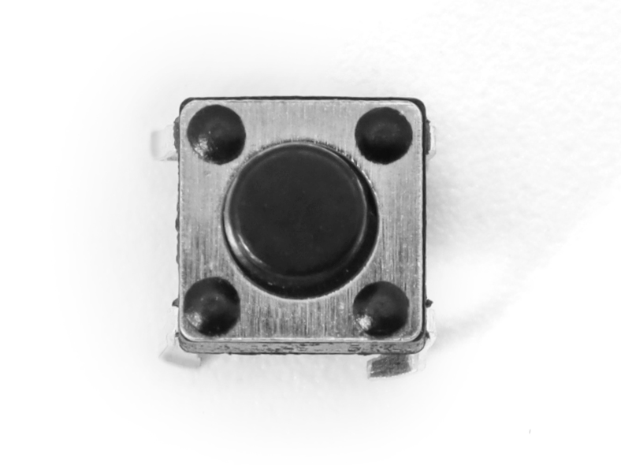
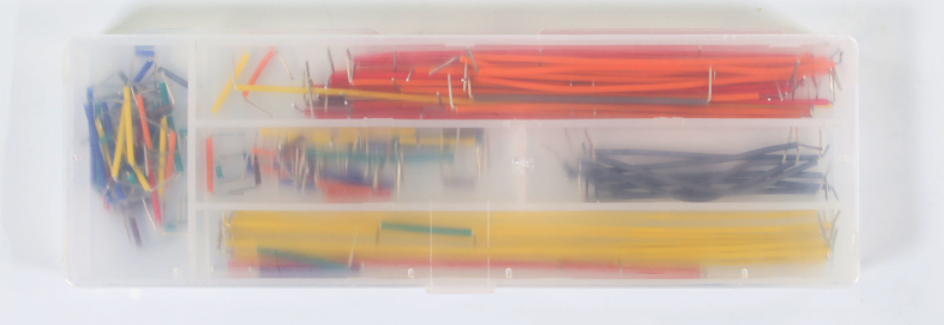

# 小智AI聊天机器人面包板DIY套装 128x32 OLED版本

## 简介
这是一套利用简易硬件与语音识别技术，能让你在面包板上快速搭建出“小智AI聊天机器人”原型的DIY套件。它包含ESP32-S3-DevKitC-1开发板、MEMS数字麦克风（INMP441）、数字功放（MAX98357A）、腔体喇叭等关键元件，支持语音输入与语音播放，并预留接口供更多扩展，实现初级人机交互功能。

## 主要特色
- **简易搭建，快速上手**：所有元件都可插接于面包板，无需复杂焊接技术。  
- **语音输入**：内置MEMS数字麦克风（INMP441），有效降低环境噪声干扰。  
- **音频输出**：数字功放（MAX98357A）与腔体喇叭组合，可播放清晰语音。  
- **可扩展**：预留多余GPIO、I²C等接口，方便为机器人添加更多传感器或功能模块。  
- **学习友好**：通过动手搭建与调试，深入了解AI语音识别与播放的基本原理。  

## 所需硬件

| 硬件名称                    | 规格/型号                          | 主要用途                                  | 相关图片（示例） |
|----------------------------|------------------------------------|-------------------------------------------|------------------|
| 开发板                     | ESP32-S3-DevKitC-1 (WROOM N16R8 模组) | 主控板，负责运行固件、处理语音与网络连接等 | 
 |
| 数字麦克风                 | INMP441                             | 采集音频输入                               | 

  |
| 功放                       | MAX98357A                           | 音频输出驱动（将数字信号转换成模拟音频）   | 

 |
| 腔体喇叭                   | 8Ω 2~3W 或 4Ω 2~3W                  | 输出声音的扬声器                           | 
 |
| 导线                       | 跳线一盒、杜邦线若干                | 模块与开发板间的连接                       | 
  |
| 面包板（2块）              | 400 孔，可拼接                     | 方便直插连接各种电子元件                   | 
 |
| 液晶显示屏                 | 128x32 I2C (SSD1306 驱动)           | 显示WiFi状态、对话信息、其他提示等         | 
 |
| 微动开关/按钮（若干）      | 6×6mm 立式轻触开关                  | 音量调节及其他交互操作                     | 
 |
| Type-C 数据线              | 用于烧录固件                        | 连接开发板与PC，为固件烧录及调试提供接口    | 
 |

## 硬件介绍

### 1. ESP32-S3-DevKitC-1开发板

ESP32-S3-DevKitC-1 是一款基于 Espressif ESP32-S3 系列芯片的高性能开发板，集成 2.4 GHz Wi-Fi 和蓝牙 5.0/BLE 无线连接，并搭载最高 240 MHz 双核 Xtensa® LX7 处理器，支持机器学习硬件加速，可在语音识别、图像处理等 AI 场景下实现高效推理。下面分别介绍其主要特点与关键参数。

## 主要特点

- **高性能处理**  
  - Xtensa® LX7 双核架构，主频最高可达 240 MHz  
  - 支持机器学习硬件加速，提高 AI 应用推理速度

- **无线连接**  
  - 集成 2.4 GHz 802.11 b/g/n Wi-Fi  
  - 支持蓝牙 5.0 及蓝牙低功耗 (BLE)，便于多种场景下的短距离通信

- **丰富的接口**  
  - 最多可达 38 个 GPIO 引脚  
  - 内置多种通信协议：ADC（12 位）、DAC、PWM、I2C、SPI、UART 等  
  - 板载 LED 指示灯以及 Boot、Reset 等功能按键

- **安全特性**  
  - 硬件加密引擎（AES、SHA、RSA 等）  
  - 支持 Secure Boot 与 Flash Encryption，从硬件到固件多重保障

- **低功耗设计**  
  - 待机功耗低至约 10 μA，Wi-Fi 运行时功耗同样经过优化  
  - 适用于依赖电池供电或需长续航的项目

- **开发生态**  
  - 支持 Arduino IDE，适合快速上手  
  - 兼容 ESP-IDF、PlatformIO 等高级开发框架，便于定制化项目

### 2. MEMS 数字麦克风（INMP441）

#### 简介  
INMP441 是一款采用 MEMS 工艺的数字麦克风，内置放大、模数转换与 I²S 输出。相比传统模拟麦克风，可有效减少噪声干扰，方便在语音识别与交互等领域应用。

#### 特点  
1. **I²S 数字输出**：直接输出数字音频，避免模拟线缆干扰。  
2. **体积小、易集成**：适用于空间受限的项目。  
3. **低功耗**：适合电池供电场景。  
4. **高灵敏度**：可采集微弱声音，适合语音识别。  
5. **自带稳压与时钟**：减少外部电路需求，简化焊接。  
6. **焊接难度较高**：建议使用已焊接好排针的模块。

#### 主要参数

| 参数              | 数值 / 范围             | 说明                                        |
|-------------------|-------------------------|---------------------------------------------|
| **工作电压**      | 3.3V (典型)            | 建议 1.8V ~ 3.3V                            |
| **输出接口**      | I²S                     | 左对齐、单声道输出                          |
| **信噪比**        | ~61 dB                 | 信噪比越高，音质越纯净                      |
| **灵敏度**        | -26 dBFS (典型)        | 94 dB SPL、1kHz 输入条件下测得             |
| **频响范围**      | 60 Hz ~ 15 kHz (典型)   | 满足大部分人声采集需求                     |
| **电流消耗**      | 1.1 mA ~ 1.7 mA         | 典型工作电流                                |
| **封装尺寸**      | 3.76 mm × 2.95 mm       | 需精细焊接工艺                              |

### 2. 数字功放（MAX98357A）

####  简介  
MAX98357A 是一款集成度高的 D 类音频功放芯片，可直接通过 I²S 输入数字音频并放大输出。它省去了传统功放所需的 DAC 等环节，效率更高、体积更小，广泛应用于便携音箱、智能音箱等产品中。

####  特点  
1. **I²S 数字输入**：无需额外 DAC，简化设计。  
2. **D 类高效率**：可达 90% 以上，适合电池供电场景。  
3. **内置滤波/PLL**：适应多种采样率，输出稳定可靠。  
4. **简化外围电路**：只需少量电容电阻即可工作。  
5. **保护机制**：具备过流、过热等保护功能，使用更安全。  
6. **驱动多种扬声器**：可带动 4Ω/8Ω 扬声器，适应小功率音频应用。

####  主要参数

| 参数             | 数值 / 范围       | 说明                        |
|------------------|-------------------|-----------------------------|
| **工作电压**     | 2.5V ~ 5.5V       | 常用 3.3V 或 5V             |
| **输出功率**     | 3W@4Ω / 2W@8Ω     | 视电压与散热条件而定        |
| **效率**         | 高达 90% 以上     | 有效减少能量损耗             |
| **采样率**       | 8kHz ~ 96kHz      | 内置 PLL，支持多种格式       |
| **THD+N**        | < 0.03% @1W, 5V   | 保证较好音质                 |
| **保护功能**     | 过热 / 过流 / 短路 | 增加安全性                   |

> **注意**: 建议预留散热空间，正确匹配扬声器阻抗并合理设置增益，避免失真或芯片损坏。

### 3. 腔体喇叭（8Ω 2W ）

####  简介  
此类喇叭在封闭或半封闭腔体中工作，能优化低频、集中声能。常见于便携音箱、智能语音设备等。

####  特点  
1. **阻抗与功率适配**：8Ω，功率 2W，适合小型功放。  
2. **提升低频**：腔体设计有助于增强低频下潜。  
3. **小巧易装**：多配备卡扣或螺丝孔，便于集成。  
4. **常用范围广**：适合多种环境音量需求。

####  主要参数

| 参数          | 数值 / 范围       | 说明                              |
|---------------|-------------------|-----------------------------------|
| **阻抗**      | 8Ω           | 通用规格，匹配小功放              |
| **额定功率**  | 2W              | 日常音量场景                      |
| **频率响应**  | ~200Hz ~ 20kHz     | 腔体优化中低频表现                |
| **灵敏度**    | 80~90 dB (@1W/1m)  | 灵敏度较高，能效更佳              |
| **安装方式**  | 螺丝/卡扣/背胶    | 视具体型号而定                    |

> **注意：** 建议搭配合适的数字功放（如 MAX98357A）并校准音量，避免过载导致失真或损坏。

### 4. 盒装跳线，

**盒装跳线简介**  
盒装跳线是指各类杜邦线（公对公、公对母、母对母）按长度和颜色分装于小格子中的一整套套件，可用于面包板或电路项目的快速搭建与连接。

**主要特点**  
1. 多种线长与接口形式，适配不同接线需求。  
2. 色彩丰富，易区分电路走线。  
3. 盒装设计，携带与存储方便。

### 5. 面包板（2块 400 孔，可拼接，可选，推荐）

面包板可用于快速搭建、调试原型电路，免焊接，且能有效管理线路接口，避免布线杂乱。400 孔设计足以容纳常见模块和跳线，且可通过拼接扩展更大面积。便于元器件插拔与布局调整，适合电子爱好者与初学者使用。

> **提示**：善用面包板上的电源和地线排布，能提高电路整洁度和稳定性。

### 6. OLED 显示屏（IIC 接口）

####  简介  
此类 OLED 屏常搭载 SSD1306 驱动，通过 I²C 接口进行通信。它具有高对比度、低功耗、体积小等优势，广泛应用于各类微控制器项目以及嵌入式产品。建议选用以 GND 引脚作为基准的新版屏幕，稳定性更佳。

####  特点  
1. **高对比度**：OLED 自发光像素，可呈现清晰文字与图形。  
2. **低功耗**：相比 LCD 同尺寸产品，功耗更低，适合电池供电项目。  
3. **SSD1306 驱动**：通用度高，开源库多，易于开发与移植。  
4. **I²C 通信**：占用引脚少，线材简单，便于面包板或小型设备集成。  
5. **小体积**：适合便携式或空间受限的项目设计。

####  主要参数

| 参数             | 数值 / 范围                       | 说明                               |
|------------------|-----------------------------------|------------------------------------|
| **驱动芯片**     | SSD1306                            | 兼容多种微控制器                   |
| **通信接口**     | I²C                                | SDA (数据) + SCL (时钟) 两条线      |
| **分辨率**       | 常见有 128×64、128×32             | 根据项目需求选择                   |
| **工作电压**     | 3.3V ~ 5V 视模块而定               | 一般推荐 3.3V 供电                 |
| **功耗**         | μA 级待机电流，mA 级工作电流       | 取决于亮度与内容刷新率             |
| **屏幕尺寸**     | 0.91 、0.96、1.3 英寸等多种可选            | 看需求决定尺寸                     |
| **工作温度**     | 约 -30℃ ~ 70℃                      | 适应多数常见环境                   |

### 7. 微动开关/按钮

#### 简介  
微动开关（6×6 mm）通常用于测试、控制以及人机交互场景，体积小巧，轻触即触发。

#### 特点  
1. **尺寸小**：易于嵌入各种设备或面包板。  
2. **轻触式设计**：手感好，触发明确。  
3. **安装便捷**：四脚设计可分开插入，省去焊接麻烦。

#### 参数  
- **外形尺寸**：6×6 mm（典型）  
- **脚位数量**：4 脚，同向脚位相互连通  
- **额定电流**：约 50 mA（视型号而定）  
- **工作温度**：-25°C ~ 85°C（不同品牌略有差异）  

> **提示**：为防止短接引脚，新手可优先选择直插式按钮，接线更简单，降低误操作风险。

