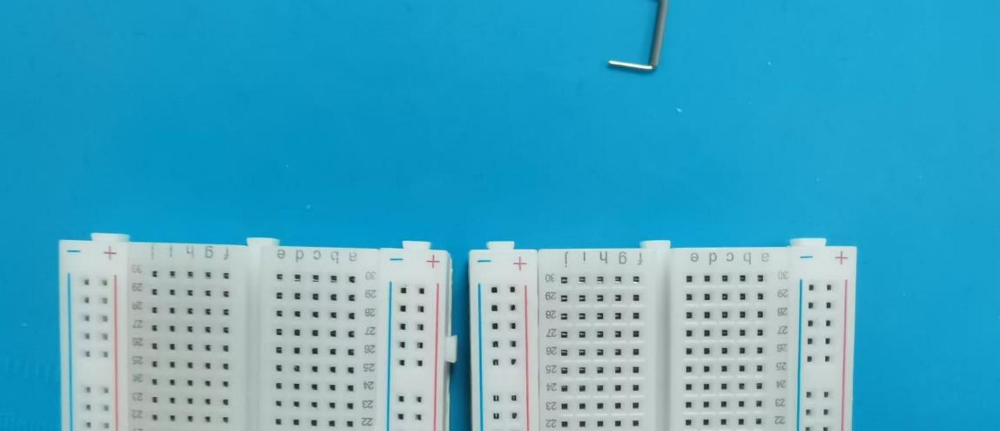
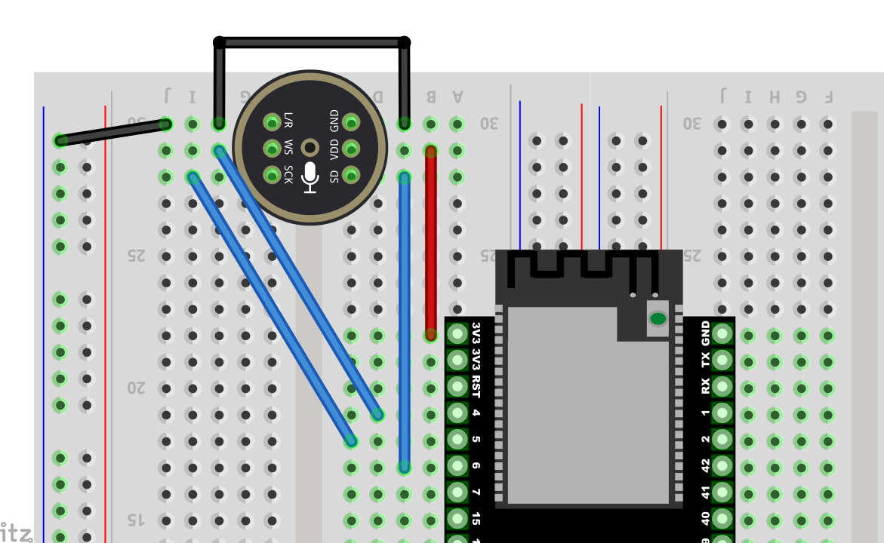
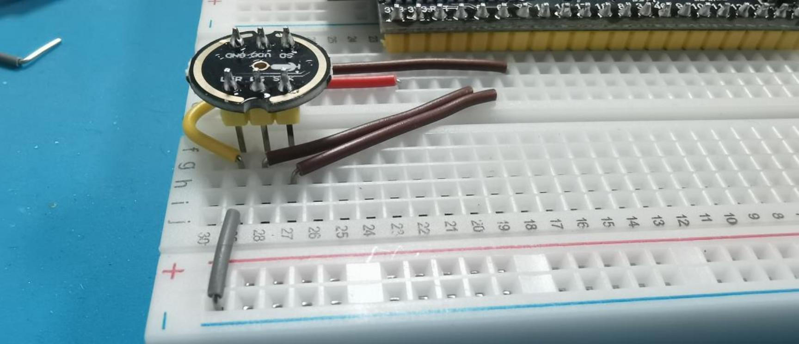

# 接线

## ESP32S3 开发板与各模块接线脚位明细

### 1. ESP32S3 开发板与麦克风接线
| **ESP32S3开发板**                      | **麦克风 INMP441（I2S接口）**                                                                                        |
|-----------------------------------------|---------------------------------------------------------------------------------------------------------------------|
| GPIO **4**                              | **WS** 数据选择                                                                                                   |
| GPIO **5**                              | **SCK** 数据时钟                                                                                                  |
| GPIO **6**                              | **SD** 数据输出                                                                                                   |
| **3V3**                                  | **VDD** 电源正 3.3V                                                                                               |
| **GND**                                  | **GND** 接地 **短接** **L/R** 左右声道                                                                             |

---

### 2. ESP32S3 开发板与数字功放接线

| **ESP32S3开发板**                      | **数字功放 MAX98357A**                                                                                                 |
|-----------------------------------------|-----------------------------------------------------------------------------------------------------------------------|
| GPIO **7**                              | **DIN** 数字信号                                                                                                    |
| GPIO **15**                             | **BCLK** 位时钟                                                                                                     |
| GPIO **16**                             | **LRC** 左右时钟                                                                                                   |
| **3V3** / 3.3V                          | **Vin（或VCC）** 电源输入 **短接** **SD** 关机频道                                                                    |
| **GND**                                  | **GND** 接地 **短接** GAIN 增益和频道 （**BGA封装麦克风不接**）                                                     |
|                                         | **音频+** 接 **喇叭正极**（一般**红线**，必要时可用万用表测试）                                                     |
|                                         | **音频-** 接 **喇叭负极**                                                                                           |

---

### 3. ESP32S3 开发板与显示屏接线

| **ESP32S3开发板**                      | **显示屏（IIC/I2C接口，可选）**                                                                                      |
|-----------------------------------------|---------------------------------------------------------------------------------------------------------------------|
| GPIO **41**                             | **SDA** 数据线                                                                                                     |
| GPIO **42**                             | **SCK** 时钟线                                                                                                     |
| **3V3** 3.3V                           | **VCC** 电源正                                                                                                     |
| **GND**                                  | **GND** 接地                                                                                                     |

---

### 4. ESP32S3 开发板与按钮接线

下表为新增音量调节和 Boot/唤醒按钮的参考连线示意。  
请注意四脚开关的同向引脚是连通的，若在面包板上使用，请避免将四个引脚都插在同一排内。

| **ESP32S3 开发板** | **按钮功能**                                                 |
|--------------------|-------------------------------------------------------------|
| GPIO **39**        | 接“音量减”按钮（另一头接 GND），短按减音量，长按静音       |
| GPIO **40**        | 接“音量加”按钮（另一头接 GND），短按增音量，长按最大音量   |
| GPIO **0** | 可接“唤醒/中断”按钮（另一头接 GND），按下可打断/恢复对话  |

> **提示**：  
> - 焊接或插接按钮时，避免在同一排导致引脚短接，否则会呈现常按状态。

## ESP32S3 开发板与各模块接线步骤示意图

**先上一个完整的图**

第一步面包拼接，是有卡扣的，扣在一起就可以了

第二步面包板有 6 个凸出来的为上

开始接 ESP32 开发板。开发板从左边 A1 开始对着孔位。顶住最下面那一格

第三步开始接线，注意对着引脚。如不会看的，可以对照数字。 圆型的 INMP441 接线：

然后 INMP441 怎么插。如图

第四步 0.91 寸屏，

第五步：MAX98357 接法：

接好线后插功放：3 根橙色的线是跟 功放的 LRC/BCLK/DIN 对齐的

第六步：按键接法：

完成后图

这样就可以进入下一步，进行配网了

## 常见接线问题 FAQ

1. **烧录固件后，RGB灯不亮**  
   - 请检查 RGB 灯周围的焊点是否已焊好。若有未焊接处，可先用导线将对应焊盘接通，重启后查看灯光能否正常亮起。

2. **如何检查电路故障？**  
   - **未接电源时**：可用万用表测量导线与 GND 或 3.3V 引脚间的导通情况，排查是否有短路或断路。  
   - **接上电源后**：测量 GND 与其他引脚的电压值是否在正常范围（例如 5V、3.3V）；若异常，可继续追查对应模块和连线。

3. **为什么四脚按钮要错行插接？**  
   - 四脚按键中同向的两脚本身是连通的，若同一行插入面包板，会导致始终短接，按钮无法正常工作。务必将四脚分开两行插入，使按下时才闭合电路。

4. **I²C（SDA/SCL）和 I²S（BCLK/LRCLK/DIN 等）能否共用引脚？**  
   - 不建议。I²C 与 I²S 的硬件信号格式、时序和协议均不兼容，必须使用各自对应的独立 GPIO 引脚。

5. **音量调节按钮为何没有效果或一直处于静音？**  
   - 请确认已接到正确 GPIO（例如 39 与 40），且“音量加 / 音量减”按钮脚位未插反。若硬件无误，再检查固件版本与示例代码配置是否匹配。

6. **面包板使用时频繁出现接触不良怎么办？**  
   - 可能是面包板插孔老化或元件引脚氧化。可尝试更换新面包板、清理元器件引脚，或使用更短的跳线以减少故障点。

7. **传感器、电源模块等如何共地？**  
   - 外接模块的地线需与主控板 GND 保持一致，统一接到同一条地线上，避免产生噪声或信号不稳定问题。

> **提示**：若遇到无法定位的问题，可排查电源是否稳定（如 5V 或 3.3V 供电），并确认固件版本及示例代码与连线实际情况对应一致。