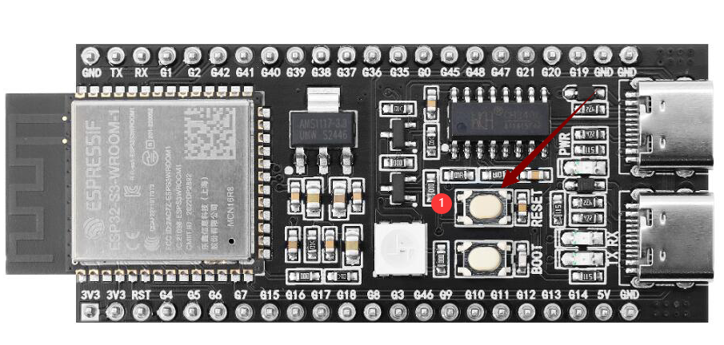

# Flash 烧录固件（无 IDF 开发环境）

本说明适用于 **ESP32-S3-WROOM-N16R8** 版本的固件烧录，使用 **Flash Download Tool** 工具。

**刷机工具一键下载**

 [**刷机工具**](刷机工具.rar)

**刷机固件一键下载**

 [**刷机固件**](刷机固件.rar)

---

## 1. 准备工作

- **操作系统**：以 Windows 为例，推荐使用 **Flash Download Tool 3.9.7**（其他较新版本亦可）。  
- **获取工具**：从 [Espressif官网下载](https://www.espressif.com.cn/zh-hans/support/download/other-tools) 并解压到任意文件夹，无需安装。  
- **运行方式**：进入解压后的目录，双击 `flash_download_tool_3.9.7.exe` 即可启动。

---

## 2. 下载固件

1. **下载并解压**  
   - 前往 [GitHub Releases](https://github.com/78/xiaozhi-esp32/releases) 页面，根据所需版本下载固件压缩包，如示例中的   
   - 解压后可得到 `merged-binary.bin` 文件。

点击下载，然后解压。

2. **复制 `.bin` 文件至指定目录**  
   - 将解压得到的 `merged-binary.bin` 建议放于 **Flash Download Tool** 的 `bin` 目录下，便于后续操作。

> 其他 Releases 版本可在项目下方查阅。

---

## 3. 烧录固件 / 下载到开发板

解压并进入 `flash_download_tool_3.9.7` 目录，双击运行 `flash_download_tool_3.9.7.exe`，界面如下所示：

### 1）下载设置

1. **芯片类型（ChipType）**：选择 `ESP32-S3`  
2. **工作模式（WorkMode）**：选择 `Develop`  
3. **加载模式（Download Mode）**：建议选择 `UART`（若选 USB，需额外设置，此处不做介绍）

**接口及 sRGB 说明**：  
- 当开发板 Type-C 接口面向自己时，右侧插口为 **UART** 接口，左侧为 **USB** 接口，请勿混淆。  
- 若板载 sRGB 灯未焊接，工具识别时可能会出现提示警告（不影响烧录），后续可通过短接焊盘解决（见文档末位置 2）。

---

### 2）加载固件 & SPI 下载设置

1. **输入固件路径**：在第一个空白框点击 `...` 按钮，选择 `merged-binary.bin` 文件。

2. **勾选固件选项**：在所导入 `.bin` 文件前的复选框 **打勾**，并在后方地址栏输入 `0x0` 或 `0x00` 以表示烧录到存储器的起始地址。  
3. **COM 端口**：在系统的“设备管理器”中展开串口项目，查看对应的 **COM 端口号**，并在工具中选择相同的端口。  
4. **速率设置**：默认 SPI 速度即可，`BAUD` 速率可选较高数值以提升烧录速度。

5. **开始烧录**：点击 `START`，进度条开始运行，直至出现 **FINISH** 成功提示。整个过程通常需数分钟到十余分钟不等，取决于固件容量和速率设置。

---

## 烧录完成

烧录完成后，按下开发板上的 `RST（Restart）` 按钮（下图位置 1）重启板子，即可进入 **Wi-Fi 配网模式**。配网操作详见后续说明。

