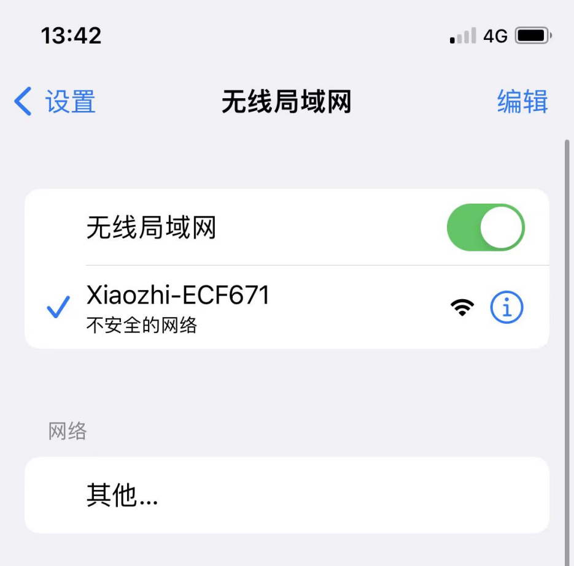

# 如何配置设备 Wi-Fi

## 1. Wi-Fi 网络配置

### 1) 启动设备
- 烧录固件完成后，保持设备通电，按下 **RST** 按钮（下图位置 1）重启，设备将进入配网模式。  

### 2) 配网状态
- **sRGB 彩灯为蓝色闪烁**：表示处于配网状态。  
- **sRGB 彩灯一直不亮**：详情见本页第 2 节说明。  
- 若设备不在配网状态或需要重新配网，可按住 **配网按键（连接 1 号 GPIO）**，再按下 **RST** 复位；先松开 RST，再松开配网按键重新进入配网。  
- 固件版本 ≥0.2.2 时，如三次连接原 Wi-Fi 失败，将自动回到配网模式（切换网络时可按 RST 重启设备）。

### 3) 配网步骤
1. **连接“小智”Wi-Fi**  
   使用手机或电脑连接设备发出的 Wi-Fi（名称通常形如 *Xiaozhi-XXXXXX*）。  
    

2. **配置网络**  
   在浏览器地址栏输入 `http://192.168.4.1` 进入配置页面。  
      
   > - 选择 2.4G Wi-Fi（如果用 iPhone 热点，需打开“最大兼容性”）。  
   > - 输入密码，点击 **Connect**。  
   > - 若连接成功，界面显示 “Done” 并在 3 秒后自动重启。

---

## 2. 关于设备上的 sRGB 彩灯

1. **连接和更新状态**  
   - 通电后蓝色闪烁一次：设备正在连接 Wi-Fi；若随后 **绿灯闪烁**，表示连接成功，可被语音唤醒。  
   - 若蓝色长亮：正在 OTA 固件更新，通常不到一分钟即可完成。  
   - 若蓝色一直闪烁：设备正处于配网状态。  
   - 语音唤醒时蓝色亮起：表示正在连接服务器。  
   - 绿色亮起：表示设备正在播放语音。  
   - 红色亮起：表示设备正在录音。

2. **sRGB 彩灯不亮**  
   - 若灯的开关未焊接，虽不影响配网，但将无法查看设备状态。建议自行或请他人焊锡短接（见文档图示位置 2）。

> **提示**：购买开发板时，可先确认是否已焊接 sRGB 彩灯开关，以免后期需手动焊接。

---

## 3. 如何添加设备

1. **确认设备联网上线**  
   - 当设备连接到网络后，语音唤醒并提示要添加设备的 6 位验证码（可重复唤醒获取）。

2. **访问控制面板**  
   - 打开 [小智AI聊天机器人-控制面板](https://xiaozhi.me/)（若无账号可先注册）。  

3. **设备管理**  
   - 在菜单选择“设备管理”，点击“添加新设备”。  
   - 输入 6 位数字的 **设备 ID**，点击“添加设备”按钮。  
   

4. **激活成功**  
   - 设备会自动激活并显示在“设备管理”页面，即可正常使用。