# KT0373 - 小智AI聊天机器人面包板DIY套装带摄像头
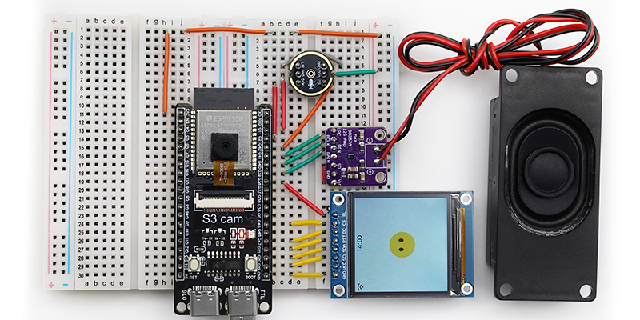

## 简介
这是一套利用简易硬件、语音识别及视觉技术，能让你在面包板上快速搭建出“小智AI聊天机器人（视觉版）”原型的DIY套件。它包含**ESP32-S3-CAM开发板**、摄像头、MEMS数字麦克风（INMP441）、数字功放（MAX98357A）、腔体喇叭等关键元件，不仅支持语音输入与播放，还增加了**视觉能力**，可实现更丰富的人机交互功能。

## 主要特色
- **视觉增强**：集成摄像头模块，为AI机器人增加“眼睛”，可用于图像识别、监控等场景。
- **简易搭建，快速上手**：所有元件都可插接于面包板，无需复杂焊接技术。
- **语音输入**：MEMS数字麦克风（INMP441），有效降低环境噪声干扰。
- **音频输出**：数字功放（MAX98357A）与腔体喇叭组合，可播放清晰语音。
- **学习友好**：通过动手搭建与调试，深入了解AI语音、视觉技术的基本原理。

## 所需硬件

| 硬件名称 | 规格/型号 | 主要用途 | 图片 |
| --- | --- | --- | --- |
| **开发板** | **ESP32-S3-CAM** | **主控板，负责运行固件、处理音视频与网络连接** | 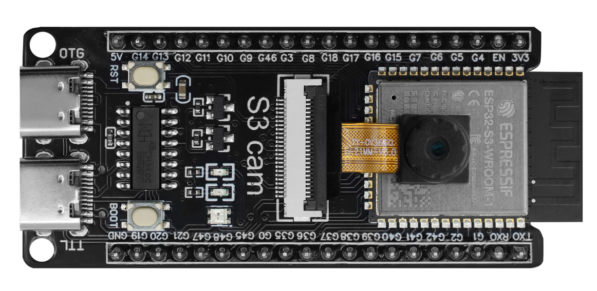 |
| 数字麦克风 | INMP441 | 采集音频输入 | 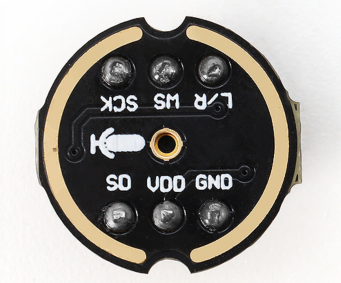 |
| 功放 | MAX98357A | 音频输出驱动 | 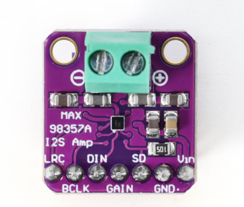 |
| 腔体喇叭 | 8Ω 2~3W 或 4Ω 2~3W | 输出声音的扬声器 | 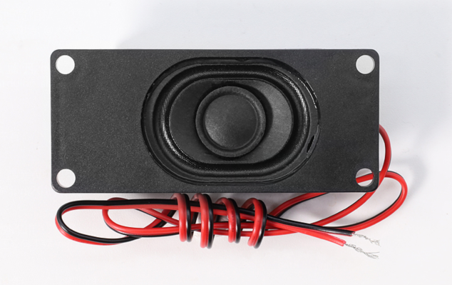 |
| 导线 | 跳线一盒、杜邦线若干 | 模块与开发板间的连接 | 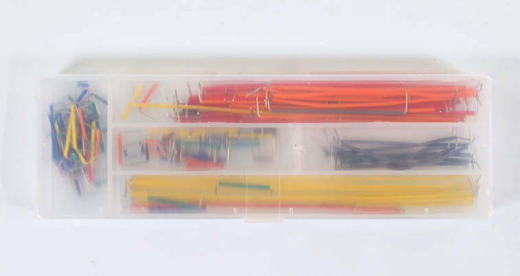 |
| 面包板（2块） | 400 孔，可拼接 | 方便直插连接各种电子元件 | 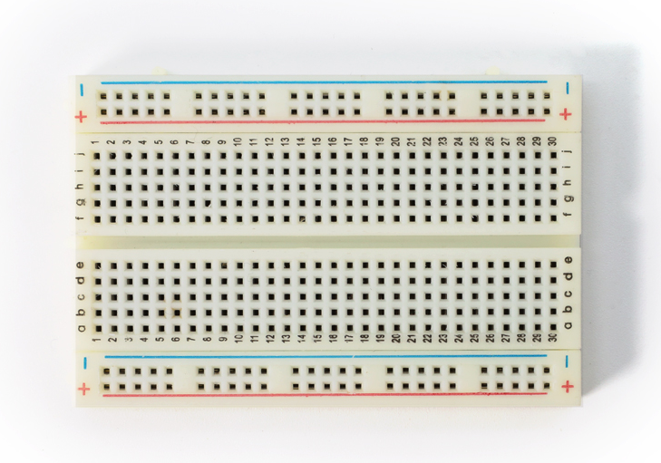 |
| Type-C 数据线 | 用于烧录固件 | 连接开发板与PC，为固件烧录及调试提供接口 | 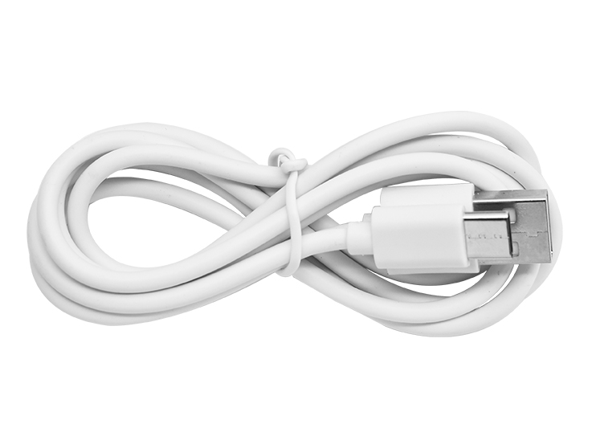 |

## 硬件介绍

### 1. ESP32-S3-CAM开发板

ESP32-S3-CAM 是一款专为视觉应用设计的开发板，基于乐鑫ESP32-S3芯片，集成了Wi-Fi与蓝牙功能。它板载了摄像头接口、SD卡槽等，并引出多个GPIO，是开发物联网摄像机、视觉识别等项目的理想选择。

**主要特点**
-   **高性能处理**：搭载Xtensa® LX7双核处理器，主频高达240 MHz，支持AI硬件加速。
-   **摄像头接口**：板载24-pin摄像头连接器，通常搭配OV系列摄像头使用。
-   **无线连接**：集成2.4 GHz Wi-Fi和蓝牙5.0 (BLE)。
-   **丰富接口**：除摄像头接口外，还引出多个GPIO引脚，支持I²S, I²C, SPI, UART等多种协议，方便连接麦克风、功放等外设。
-   **存储扩展**：部分型号板载MicroSD卡槽，方便存储图片或固件。

### 2. MEMS 数字麦克风（INMP441）
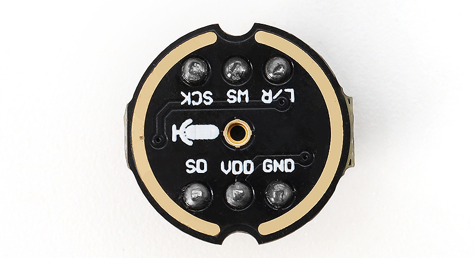
INMP441是一款高性能、低功耗的数字I²S接口MEMS麦克风。它直接输出数字信号，抗干扰能力强，非常适合用于语音唤醒和AI语音交互项目。

### 3. 数字功放（MAX98357A）
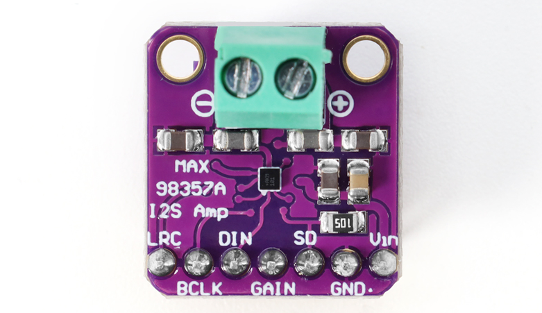
MAX98357A是一款D类音频功率放大器，同样采用I²S接口。它能直接接收数字音频信号并驱动喇叭，无需外部DAC，电路简洁，效率高，是便携式音频设备的首选。

### 4. 腔体喇叭（8Ω 2W ）

带有独立音腔的喇叭，能够提供比普通喇叭更好的音质和音量，尤其在中低频部分表现更佳。

### 5. 盒装跳线
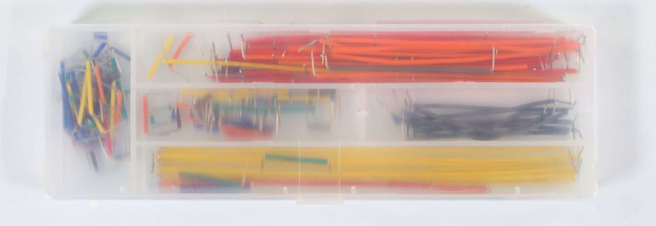
盒装跳线包含多种长度和颜色的杜邦线，可用于面包板或电路项目的快速搭建与连接，使电路清晰、易于调试。

### 6. 面包板
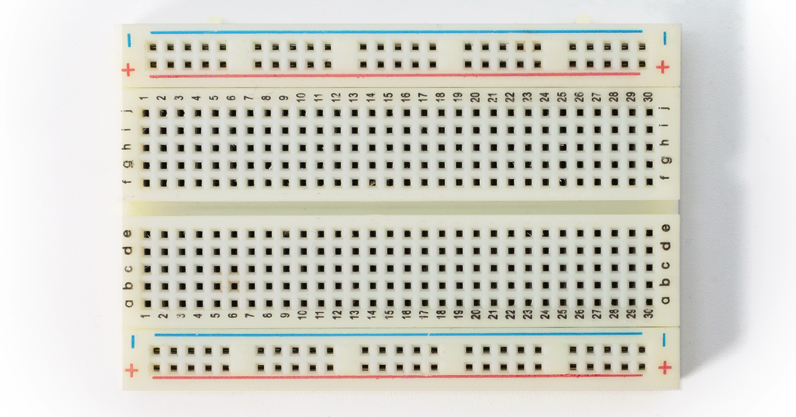
面包板可用于快速搭建、调试原型电路，免焊接，且能有效管理线路接口。400孔设计足以容纳常见模块和跳线，便于元器件插拔与布局调整。

---

# 如何接线

**注意：** 不同厂家生产的ESP32-S3-CAM开发板引脚定义可能不同，请务必以您开发板的丝印或官方文档为准！以下接线仅为推荐示例。

## ESP32S3-CAM 开发板与各模块接线脚位明细

### 1. ESP32S3-CAM 开发板与麦克风接线
| **ESP32S3-CAM开发板** | **麦克风 INMP441（I2S接口）** |
| --- | --- |
| GPIO **1** | **WS** (数据选择) |
| GPIO **2** | **SCK** (数据时钟) |
| GPIO **42** | **SD** (数据输出) |
| **3V3** | **VDD** (电源正 3.3V) |
| **GND** | **GND** (接地) **并短接** **L/R** |

---

### 2. ESP32S3-CAM 开发板与数字功放接线
| **ESP32S3-CAM开发板** | **数字功放 MAX98357A** |
| --- | --- |
| GPIO **39** | **DIN** (数字信号) |
| GPIO **40** | **BCLK** (位时钟) |
| GPIO **41** | **LRC** (左右时钟) |
| **3V3** / 3.3V | **Vin/VCC** (电源输入) **并短接** **SD** |
| **GND** | **GND** (接地) |
| | **音频+** 接 **喇叭正极** |
| | **音频-** 接 **喇叭负极** |

---

### 3. ESP32S3-CAM 开发板与摄像头接线
摄像头通常通过排线直接连接到开发板的 **24-Pin FPC连接器**上，无需手动接线。请确保排线方向正确（金属触点面朝下），轻轻推入并扣紧卡扣。

---

## 接线步骤提示
1.  **固定主板：** 将ESP32-S3-CAM开发板插入面包板中央，为两侧留出足够的空间连接其他模块。
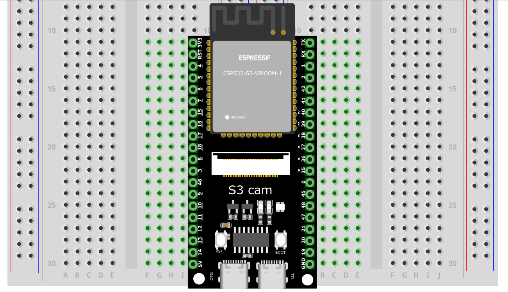

2.  **连接麦克风：** 严格按照上方的接线表，使用杜邦线将INMP441麦克风连接到开发板对应的GPIO引脚、3V3和GND。
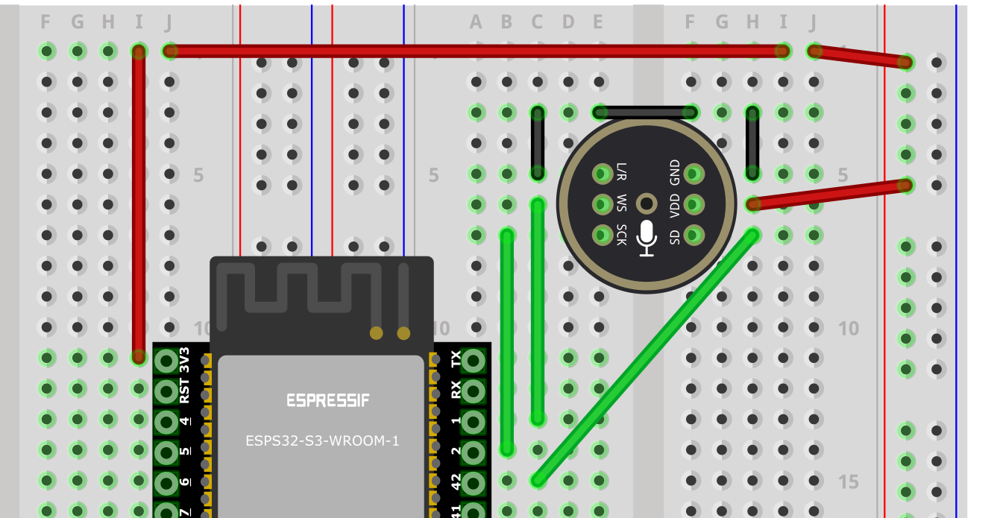

3.  **连接功放：** 严格按照上方的接线表，使用杜邦线将MAX98357A功放连接到开发板对应的GPIO引脚、3V3和GND。
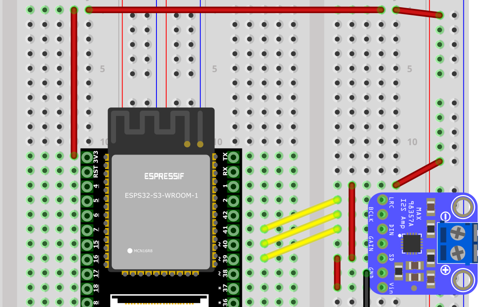

4.  **连接LCD屏幕：** *(注意：此为新增步骤，请根据您LCD屏幕的型号和引脚定义，将其连接到ESP32-S3-CAM上合适的引脚。)*
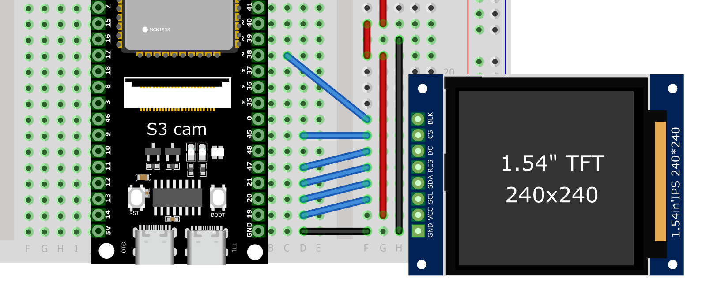

5.  **连接喇叭：** 将喇叭的导线连接到MAX98357A功放的 `音频+` 和 `音频-` 螺丝端子或插针上。
6.  **检查接线：** 完成后，仔细核对每一根线，确保没有错接或短路。
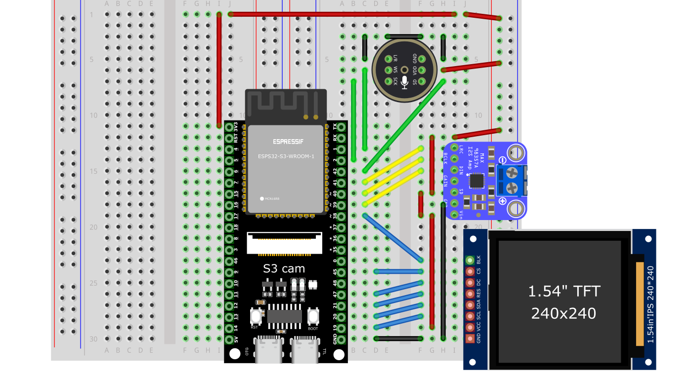

---
## 常见接线问题 FAQ

1.  **烧录固件后，RGB灯不亮**  
    *   请检查 RGB 灯周围的焊点是否已焊好。部分开发板可能需要短接跳线才能启用板载RGB灯。

2.  **如何检查电路故障？**  
    *   **未接电源时**：可用万用表测量导线与 GND 或 3.3V 引脚间的导通情况，排查是否有短路或断路。
    *   **接上电源后**：测量 GND 与其他引脚的电压值是否在正常范围（例如 5V、3.3V）；若异常，可继续追查对应模块和连线。

3.  **面包板使用时频繁出现接触不良怎么办？**  
    *   可能是面包板插孔老化或元件引脚氧化。可尝试更换新面包板、清理元器件引脚，或使用更短的跳线以减少故障点。

4.  **传感器、电源模块等如何共地？**  
    *   外接模块的地线（GND）需与主控板的GND保持一致，统一接到面包板的同一条地线总线上，避免产生噪声或信号不稳定问题。

> **提示**：若遇到无法定位的问题，可排查电源是否稳定（如5V或3.3V供电），并确认固件版本及示例代码与连线实际情况对应一致。

---

# Flash 烧录固件

我们提供两种烧录方式：**在线烧录**和**使用下载工具烧录**。推荐优先使用在线烧录，更加方便快捷。

---
## 方式一：在线烧录 (Web Flasher)
这是一种无需下载任何工具，直接通过浏览器为开发板烧录固件的方法。

**1. 准备工作**
- **浏览器**: 请使用最新版本的 **Google Chrome** 或 **Microsoft Edge** 浏览器。
- **数据线**: 确保您的Type-C数据线是数据线（能传输数据），而不仅仅是充电线。

**2. 烧录步骤**
1.  **访问烧录页面**: 在浏览器中打开在线烧录网址: **[https://flash.keyesrobot.cn/](https://flash.keyesrobot.cn)**
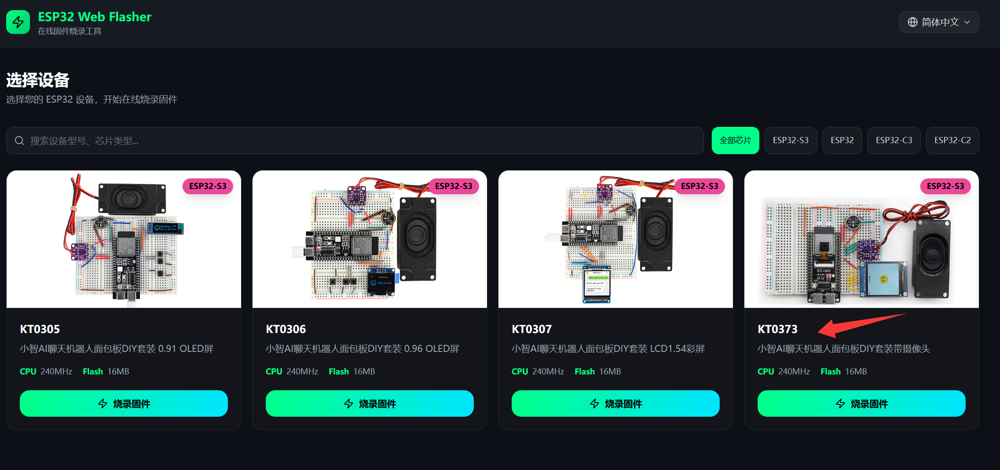

2.  **连接设备**: 选择KT0373，将ESP32-S3-CAM开发板套装通过Type-C数据线连接到电脑。
3.  **网页连接设备**:
    -   在网页上点击“**连接设备**”按钮。
    -   浏览器会弹出一个设备列表窗口，选择您的设备对应的**COM端口**（如 `COM3`、`COM4` 等），然后点击“连接”。
4.  **加载固件**:
    -   **方式A (推荐)**: 在固件列表中选择从 GitHub 或 Gitee 下载，选取最新版本的固件，点击“**下载并添加**”，固件会自动加载。
    -   **方式B**: 如果您已在本地下载好固件，可以点击“**上传固件**”来选择并加载您本地的 `.bin` 文件。
5.  **开始烧录**: 固件加载后，点击“**开始烧录**”按钮。
6.  **烧录完成**: 等待进度条走完，直到日志输出“烧录成功”等提示。

烧录成功后，按下开发板上的 `RST` 按钮即可重启设备，进入Wi-Fi配网模式。

---

## 方式二：使用 Flash Download Tool (无 IDF 开发环境)

**重要提示**：本说明适用于 **ESP32-S3-CAM** 版本的固件烧录，请确保下载了正确的固件文件。

**刷机工具一键下载**

 [**刷机工具**](刷机工具.rar)

### 1. 准备工作
-   **操作系统**：以 Windows 为例，推荐使用 **Flash Download Tool 3.9.7** 或更高版本。
-   **获取工具**：从 [Espressif官网下载](https://www.espressif.com.cn/zh-hans/support/download/other-tools) 并解压到任意文件夹，无需安装。
-   **运行方式**：进入解压后的目录，双击 `flash_download_tool_3.9.7.exe` 即可启动。

### 2. 下载固件

**固件一键下载**

 [**刷机固件**](刷机固件.zip)  

### 3. 烧录固件 / 下载到开发板

解压并进入 `flash_download_tool` 目录，双击运行 `flash_download_tool.exe`。

**1）下载设置**

1.  **芯片类型（ChipType）**：选择 `ESP32-S3`
2.  **工作模式（WorkMode）**：选择 `Develop`
3.  **加载模式（Download Mode）**：选择 `UART`

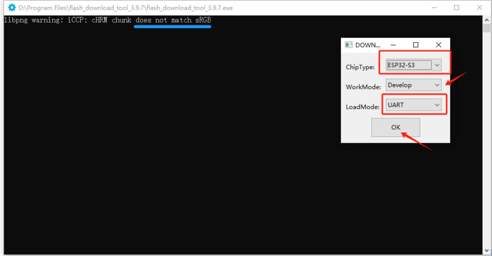

**2）加载固件 & SPI 下载设置**

1.  **加载固件文件**：在第一个空白框点击 `...` 按钮，选择下载好的适用于CAM板的 `.bin` 固件文件。
2.  **勾选并设置地址**：在导入的 `.bin` 文件前的复选框 **打勾**，并在后方地址栏输入 `0x0` 或 `0x00`，表示从起始地址开始烧录。
3.  **选择COM端口**：将开发板通过Type-C数据线连接到电脑。在系统的“设备管理器”中查看对应的 **COM 端口号**，并在工具中选择相同的端口。
4.  **设置速率**：`BAUD` 速率可选较高数值（如`921600`）以提升烧录速度。
5.  **进入下载模式**：**按住ESP32-S3-CAM板上的BOOT（或IO0）按钮不放，然后按一下RST按钮，最后松开BOOT按钮。**
6.  **开始烧录**：点击 `START`，进度条开始运行。等待直至出现 **FINISH** 成功提示。

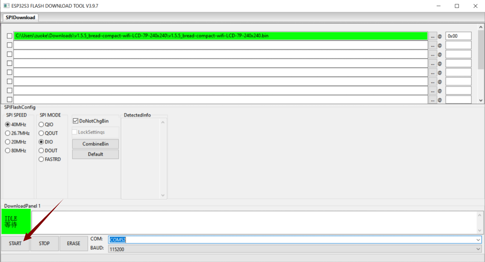

---

## 烧录完成

烧录完成后，按下开发板上的 `RST` 按钮重启板子，即可进入 **Wi-Fi 配网模式**。

---

# 如何配置设备 Wi-Fi

## 1. Wi-Fi 网络配置

### 1) 启动设备
- 烧录固件并重启后，设备将进入配网模式。

### 2) 配网状态
- **sRGB 彩灯为蓝色闪烁**：表示处于配网状态。
- 若设备不在配网状态，可长按 **BOOT（或IO0）** 按钮数秒，或重新上电使其进入配网模式。

### 3) 配网步骤
1.  **连接"小智"Wi-Fi**  
    使用手机或电脑搜索Wi-Fi，连接到设备发出的热点（名称通常形如 *Xiaozhi-XXXXXX*）。
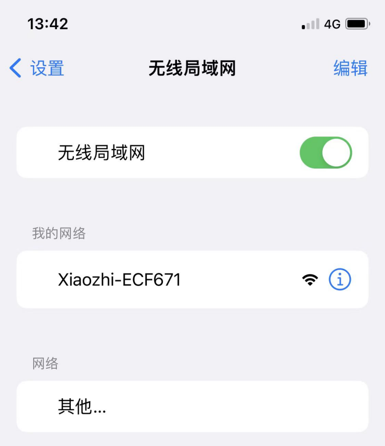

2.  **配置网络**  
    连接热点后，手机通常会自动弹出配置页面。若未弹出，请手动打开浏览器并访问 `http://192.168.4.1`。

    > - 选择您的 2.4G Wi-Fi 网络（不支持5G）。
    > - 输入Wi-Fi密码，点击 **Connect**。
    > - 若连接成功，界面将提示 "Done"，设备会自动重启并连接您的Wi-Fi。

---

## 2. 关于设备上的 sRGB 彩灯

1.  **连接和更新状态**
    -   **蓝色闪烁**：设备正处于配网状态。
    -   **蓝色长亮**：正在OTA固件更新。
    -   **绿灯闪烁**：Wi-Fi连接成功，等待唤醒。
    -   语音唤醒时**蓝色亮起**：正在连接服务器。
    -   **绿色亮起**：正在播放语音。
    -   **红色亮起**：正在录音。

2.  **sRGB 彩灯不亮**
    -   检查开发板供电是否正常。
    -   部分开发板可能需要额外焊接或短接才能启用板载sRGB灯，请查阅您的开发板说明。

---

## 3. 如何添加设备

1. **确认设备已上线**  
   - 设备成功连接网络后，会自动播报一个6位数验证码（若未听到，可再次唤醒设备获取）。

2. **进入控制台**  
   - 在浏览器中打开 [小智AI聊天机器人 - 控制台](https://xiaozhi.me/)，访问 [https://xiaozhi.me](https://xiaozhi.me)。点击右上角可切换语言。  
   

切换语言后，点击 **控制台** 进入管理界面。

没有账号先注册账号

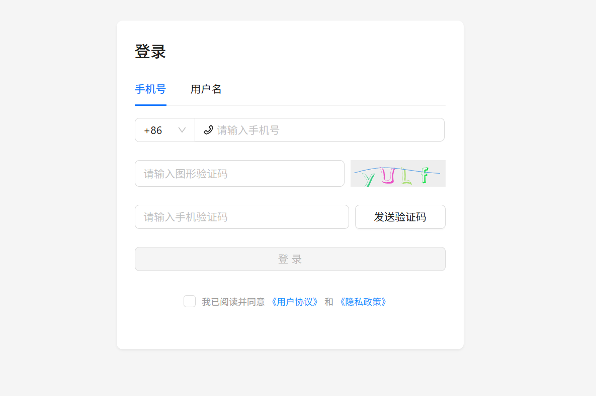

3. **设备管理**  
   - 账号注册好了之后，创建一个智能体，

   - 设置智能体的名称。  

   - 点击"**添加新设备**"。  

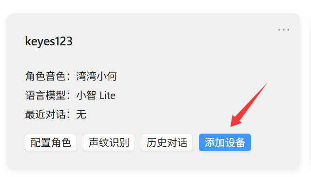
   输入6位数的 **设备ID**。  
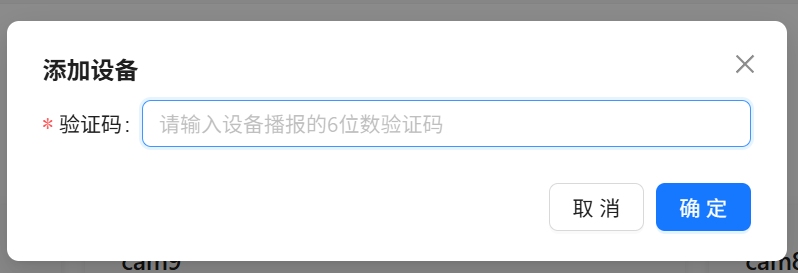

   **如何获取设备ID**：固件烧录并完成网络配置后，设备会自动播报这6位数字。

4. **激活成功**  
   - 设备将自动激活，并显示在"设备管理"页面中。点击 **配置角色** 进入配置界面。  
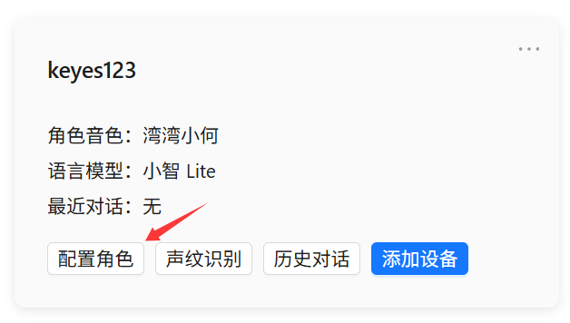

   - 配置助手的名称和音色。在"角色介绍"栏中，可借助AI工具撰写你想要的角色描述。  

   - 配置AI大模型，有多个可选项，设置完成后保存即可。  
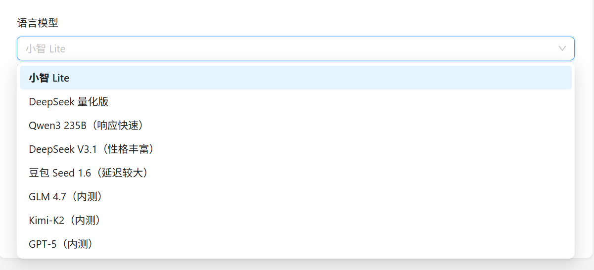

重启小智AI聊天机器人，开始对话吧！

