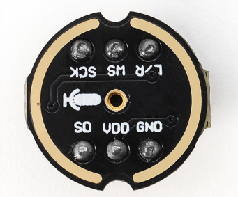
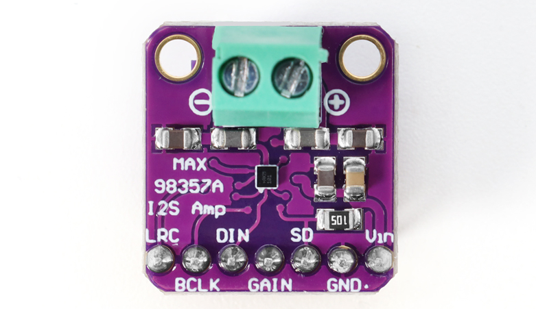
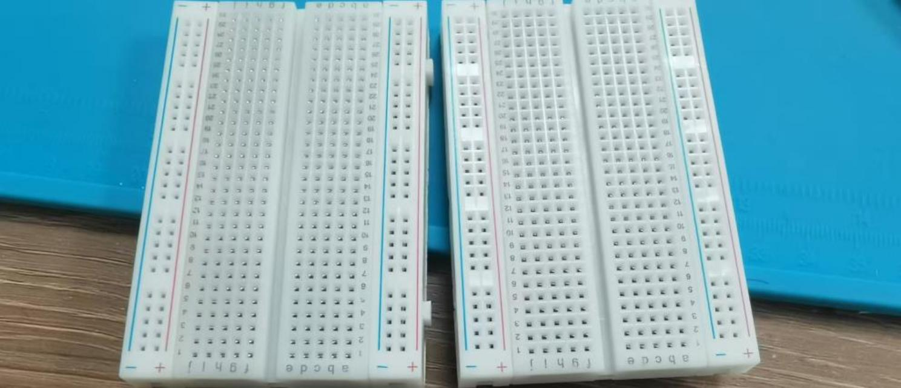
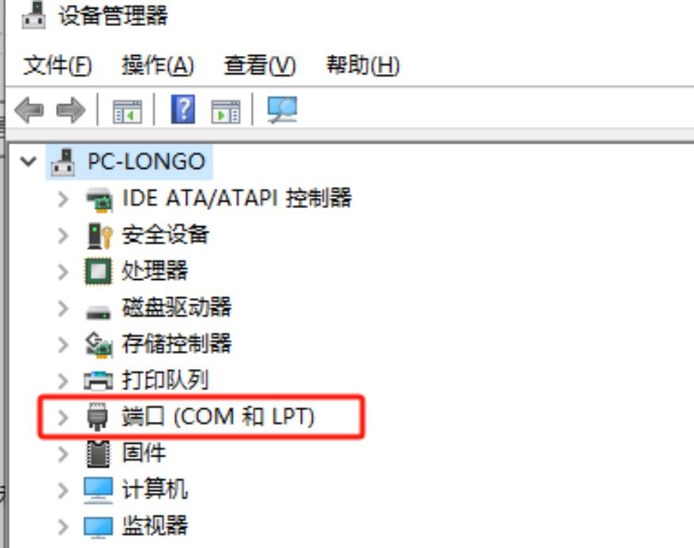
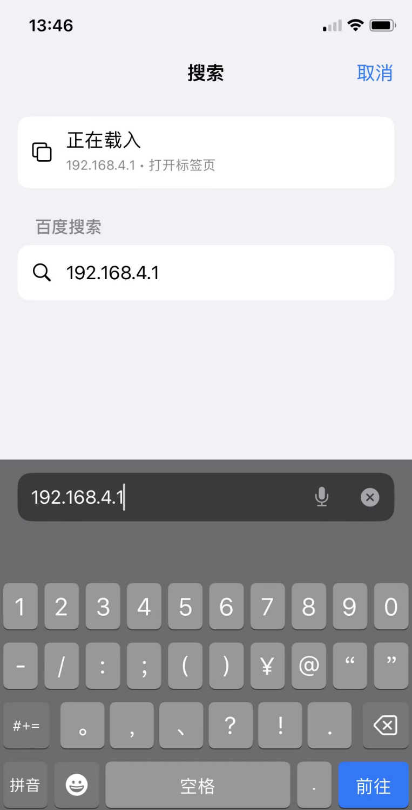
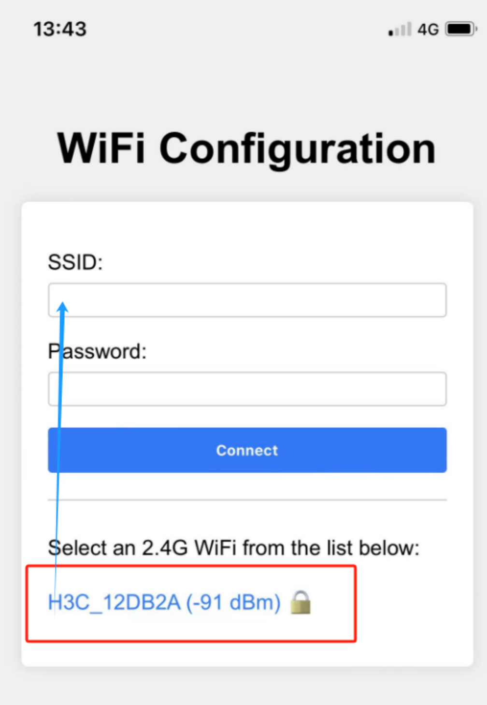

# 小智AI聊天机器人面包板DIY套装 128x64 OLED屏

## 简介
这是一套利用简易硬件与语音识别技术，能让你在面包板上快速搭建出“小智AI聊天机器人”原型的DIY套件。它包含ESP32-S3-DevKitC-1开发板、MEMS数字麦克风（INMP441）、数字功放（MAX98357A）、128x64 OLED屏、腔体喇叭等关键元件，支持语音输入与语音播放，并预留接口供更多扩展，实现初级人机交互功能。

## 主要特色
- **简易搭建，快速上手**：所有元件都可插接于面包板，无需复杂焊接技术。  
- **语音输入**：内置MEMS数字麦克风（INMP441），有效降低环境噪声干扰。  
- **音频输出**：数字功放（MAX98357A）与腔体喇叭组合，可播放清晰语音。  
- **可扩展**：预留多余GPIO、I²C等接口，方便为机器人添加更多传感器或功能模块。  
- **学习友好**：通过动手搭建与调试，深入了解AI语音识别与播放的基本原理。  

## 所需硬件

| 硬件名称                    | 规格/型号                          | 主要用途                                  | 相关图片（示例） |
|---------------------------|------------------------------------|-------------------------------------------|------------------|
| 开发板                    | ESP32-S3-DevKitC-1 (WROOM N16R8 模组) | 主控板，负责运行固件、处理语音与网络连接等 | |
| 数字麦克风                | INMP441                             | 采集音频输入                               | |
| 功放                      | MAX98357A                           | 音频输出驱动（将数字信号转换成模拟音频）     | |
| 腔体喇叭                  | 8Ω 2~3W 或 4Ω 2~3W                  | 输出声音的扬声器                            | |
| 导线                      | 跳线一盒、杜邦线若干                | 模块与开发板间的连接                         | |
| 面包板（2块）              | 400 孔，可拼接                     | 方便直插连接各种电子元件                     | |
| 液晶显示屏                | 128x64 I2C (SSD1306 驱动)           | 显示WiFi状态、对话信息、其他提示等           |
|
 |
| 微动开关/按钮（若干）      | 6×6mm 立式轻触开关                  | 音量调节及其他交互操作                       | |
| Type-C 数据线             | 用于烧录固件                        | 连接开发板与PC，为固件烧录及调试提供接口      | |

## 硬件介绍

### 1. ESP32-S3-DevKitC-1开发板

ESP32-S3-DevKitC-1 是一款基于 Espressif ESP32-S3 系列芯片的高性能开发板，集成 2.4 GHz Wi-Fi 和蓝牙 5.0/BLE 无线连接，并搭载最高 240 MHz 双核 Xtensa® LX7 处理器，支持机器学习硬件加速，可在语音识别、图像处理等 AI 场景下实现高效推理。下面分别介绍其主要特点与关键参数。

## 主要特点

- **高性能处理**  
  - Xtensa® LX7 双核架构，主频最高可达 240 MHz  
  - 支持机器学习硬件加速，提高 AI 应用推理速度

- **无线连接**  
  - 集成 2.4 GHz 802.11 b/g/n Wi-Fi  
  - 支持蓝牙 5.0 及蓝牙低功耗 (BLE)，便于多种场景下的短距离通信

- **丰富的接口**  
  - 最多可达 38 个 GPIO 引脚  
  - 内置多种通信协议：ADC（12 位）、DAC、PWM、I2C、SPI、UART 等  
  - 板载 LED 指示灯以及 Boot、Reset 等功能按键

- **安全特性**  
  - 硬件加密引擎（AES、SHA、RSA 等）  
  - 支持 Secure Boot 与 Flash Encryption，从硬件到固件多重保障

- **低功耗设计**  
  - 待机功耗低至约 10 μA，Wi-Fi 运行时功耗同样经过优化  
  - 适用于依赖电池供电或需长续航的项目

- **开发生态**  
  - 支持 Arduino IDE，适合快速上手  
  - 兼容 ESP-IDF、PlatformIO 等高级开发框架，便于定制化项目

### 2. MEMS 数字麦克风（INMP441）

#### 简介  
INMP441 是一款采用 MEMS 工艺的数字麦克风，内置放大、模数转换与 I²S 输出。相比传统模拟麦克风，可有效减少噪声干扰，方便在语音识别与交互等领域应用。

#### 特点  
1. **I²S 数字输出**：直接输出数字音频，避免模拟线缆干扰。  
2. **体积小、易集成**：适用于空间受限的项目。  
3. **低功耗**：适合电池供电场景。  
4. **高灵敏度**：可采集微弱声音，适合语音识别。  
5. **自带稳压与时钟**：减少外部电路需求，简化焊接。  
6. **焊接难度较高**：建议使用已焊接好排针的模块。

#### 主要参数

| 参数              | 数值 / 范围             | 说明                                        |
|-------------------|-------------------------|---------------------------------------------|
| **工作电压**      | 3.3V (典型)            | 建议 1.8V ~ 3.3V                            |
| **输出接口**      | I²S                     | 左对齐、单声道输出                          |
| **信噪比**        | ~61 dB                 | 信噪比越高，音质越纯净                      |
| **灵敏度**        | -26 dBFS (典型)        | 94 dB SPL、1kHz 输入条件下测得             |
| **频响范围**      | 60 Hz ~ 15 kHz (典型)   | 满足大部分人声采集需求                     |
| **电流消耗**      | 1.1 mA ~ 1.7 mA         | 典型工作电流                                |
| **封装尺寸**      | 3.76 mm × 2.95 mm       | 需精细焊接工艺                              |

### 2. 数字功放（MAX98357A）

####  简介  
MAX98357A 是一款集成度高的 D 类音频功放芯片，可直接通过 I²S 输入数字音频并放大输出。它省去了传统功放所需的 DAC 等环节，效率更高、体积更小，广泛应用于便携音箱、智能音箱等产品中。

####  特点  
1. **I²S 数字输入**：无需额外 DAC，简化设计。  
2. **D 类高效率**：可达 90% 以上，适合电池供电场景。  
3. **内置滤波/PLL**：适应多种采样率，输出稳定可靠。  
4. **简化外围电路**：只需少量电容电阻即可工作。  
5. **保护机制**：具备过流、过热等保护功能，使用更安全。  
6. **驱动多种扬声器**：可带动 4Ω/8Ω 扬声器，适应小功率音频应用。

####  主要参数

| 参数             | 数值 / 范围       | 说明                        |
|------------------|-------------------|-----------------------------|
| **工作电压**     | 2.5V ~ 5.5V       | 常用 3.3V 或 5V             |
| **输出功率**     | 3W@4Ω / 2W@8Ω     | 视电压与散热条件而定        |
| **效率**         | 高达 90% 以上     | 有效减少能量损耗             |
| **采样率**       | 8kHz ~ 96kHz      | 内置 PLL，支持多种格式       |
| **THD+N**        | < 0.03% @1W, 5V   | 保证较好音质                 |
| **保护功能**     | 过热 / 过流 / 短路 | 增加安全性                   |

> **注意**: 建议预留散热空间，正确匹配扬声器阻抗并合理设置增益，避免失真或芯片损坏。

### 3. 腔体喇叭（8Ω 2W ）

####  简介  
此类喇叭在封闭或半封闭腔体中工作，能优化低频、集中声能。常见于便携音箱、智能语音设备等。

####  特点  
1. **阻抗与功率适配**：8Ω，功率 2W，适合小型功放。  
2. **提升低频**：腔体设计有助于增强低频下潜。  
3. **小巧易装**：多配备卡扣或螺丝孔，便于集成。  
4. **常用范围广**：适合多种环境音量需求。

####  主要参数

| 参数          | 数值 / 范围       | 说明                              |
|---------------|-------------------|-----------------------------------|
| **阻抗**      | 8Ω           | 通用规格，匹配小功放              |
| **额定功率**  | 2W              | 日常音量场景                      |
| **频率响应**  | ~200Hz ~ 20kHz     | 腔体优化中低频表现                |
| **灵敏度**    | 80~90 dB (@1W/1m)  | 灵敏度较高，能效更佳              |
| **安装方式**  | 螺丝/卡扣/背胶    | 视具体型号而定                    |

> **注意：** 建议搭配合适的数字功放（如 MAX98357A）并校准音量，避免过载导致失真或损坏。

### 4. 盒装跳线，

**盒装跳线简介**  
盒装跳线是指各类杜邦线（公对公、公对母、母对母）按长度和颜色分装于小格子中的一整套套件，可用于面包板或电路项目的快速搭建与连接。

**主要特点**  
1. 多种线长与接口形式，适配不同接线需求。  
2. 色彩丰富，易区分电路走线。  
3. 盒装设计，携带与存储方便。

### 5. 面包板（2块 400 孔，可拼接，可选，推荐）

面包板可用于快速搭建、调试原型电路，免焊接，且能有效管理线路接口，避免布线杂乱。400 孔设计足以容纳常见模块和跳线，且可通过拼接扩展更大面积。便于元器件插拔与布局调整，适合电子爱好者与初学者使用。

> **提示**：善用面包板上的电源和地线排布，能提高电路整洁度和稳定性。

### 6. 128x64 OLED 显示屏（IIC 接口）

####  简介  
此类 OLED 屏常搭载 SSD1306 驱动，通过 I²C 接口进行通信。它具有高对比度、低功耗、体积小等优势，广泛应用于各类微控制器项目以及嵌入式产品。建议选用以 GND 引脚作为基准的新版屏幕，稳定性更佳。

####  特点  
1. **高对比度**：OLED 自发光像素，可呈现清晰文字与图形。  
2. **低功耗**：相比 LCD 同尺寸产品，功耗更低，适合电池供电项目。  
3. **SSD1306 驱动**：通用度高，开源库多，易于开发与移植。  
4. **I²C 通信**：占用引脚少，线材简单，便于面包板或小型设备集成。  
5. **小体积**：适合便携式或空间受限的项目设计。

####  主要参数

| 参数             | 数值 / 范围                       | 说明                               |
|------------------|-----------------------------------|------------------------------------|
| **驱动芯片**     | SSD1306                            | 兼容多种微控制器                   |
| **通信接口**     | I²C                                | SDA (数据) + SCL (时钟) 两条线      |
| **分辨率**       | 128×64             | 根据项目需求选择                   |
| **工作电压**     | 3.3V ~ 5V 视模块而定               | 一般推荐 3.3V 供电                 |
| **功耗**         | μA 级待机电流，mA 级工作电流       | 取决于亮度与内容刷新率             |
| **屏幕尺寸**     | 0.96 英寸            | 看需求决定尺寸                     |
| **工作温度**     | 约 -30℃ ~ 70℃                      | 适应多数常见环境                   |

### 7. 微动开关/按钮

#### 简介  
微动开关（6×6 mm）通常用于测试、控制以及人机交互场景，体积小巧，轻触即触发。

#### 特点  
1. **尺寸小**：易于嵌入各种设备或面包板。  
2. **轻触式设计**：手感好，触发明确。  
3. **安装便捷**：四脚设计可分开插入，省去焊接麻烦。

#### 参数  
- **外形尺寸**：6×6 mm（典型）  
- **脚位数量**：4 脚，同向脚位相互连通  
- **额定电流**：约 50 mA（视型号而定）  
- **工作温度**：-25°C ~ 85°C（不同品牌略有差异）  

> **提示**：为防止短接引脚，新手可优先选择直插式按钮，接线更简单，降低误操作风险。

# 如何接线

## ESP32S3 开发板与各模块接线脚位明细

### 1. ESP32S3 开发板与麦克风接线
| **ESP32S3开发板**                      | **麦克风 INMP441（I2S接口）**                                                                                        |
|-----------------------------------------|---------------------------------------------------------------------------------------------------------------------|
| GPIO **4**                              | **WS** 数据选择                                                                                                   |
| GPIO **5**                              | **SCK** 数据时钟                                                                                                  |
| GPIO **6**                              | **SD** 数据输出                                                                                                   |
| **3V3**                                  | **VDD** 电源正 3.3V                                                                                               |
| **GND**                                  | **GND** 接地 **短接** **L/R** 左右声道                                                                             |

---

### 2. ESP32S3 开发板与数字功放接线

| **ESP32S3开发板**                      | **数字功放 MAX98357A**                                                                                                 |
|-----------------------------------------|-----------------------------------------------------------------------------------------------------------------------|
| GPIO **7**                              | **DIN** 数字信号                                                                                                    |
| GPIO **15**                             | **BCLK** 位时钟                                                                                                     |
| GPIO **16**                             | **LRC** 左右时钟                                                                                                   |
| **3V3** / 3.3V                          | **Vin（或VCC）** 电源输入 **短接** **SD** 关机频道                                                                    |
| **GND**                                  | **GND** 接地 **短接** GAIN 增益和频道 （**BGA封装麦克风不接**）                                                     |
|                                         | **音频+** 接 **喇叭正极**（一般**红线**，必要时可用万用表测试）                                                     |
|                                         | **音频-** 接 **喇叭负极**                                                                                           |

---

### 3. ESP32S3 开发板与显示屏接线

| **ESP32S3开发板**                      | **显示屏（IIC/I2C接口，可选）**                                                                                      |
|-----------------------------------------|---------------------------------------------------------------------------------------------------------------------|
| GPIO **41**                             | **SDA** 数据线                                                                                                     |
| GPIO **42**                             | **SCK** 时钟线                                                                                                     |
| **3V3** 3.3V                           | **VCC** 电源正                                                                                                     |
| **GND**                                  | **GND** 接地                                                                                                     |

---

### 4. ESP32S3 开发板与按钮接线

下表为新增音量调节和 Boot/唤醒按钮的参考连线示意。  
请注意四脚开关的同向引脚是连通的，若在面包板上使用，请避免将四个引脚都插在同一排内。

| **ESP32S3 开发板** | **按钮功能**                                                 |
|--------------------|-------------------------------------------------------------|
| GPIO **39**        | 接“音量减”按钮（另一头接 GND），短按减音量，长按静音       |
| GPIO **40**        | 接“音量加”按钮（另一头接 GND），短按增音量，长按最大音量   |
| GPIO **0** | 可接“唤醒/中断”按钮（另一头接 GND），按下可打断/恢复对话  |

> **提示**：  
> - 焊接或插接按钮时，避免在同一排导致引脚短接，否则会呈现常按状态。

## ESP32S3 开发板与各模块接线步骤示意图

**先上一个完整的图**

第一步面包拼接，是有卡扣的，扣在一起就可以了

第二步面包板有 6 个凸出来的为上

开始接 ESP32 开发板。开发板从左边 A1 开始对着孔位。顶住最下面那一格

第三步开始接线，注意对着引脚。如不会看的，可以对照数字。 圆型的 INMP441 接线：

然后 INMP441 怎么插。如图

第四步 0.96寸OLED屏，

第五步：MAX98357 接法：

接好线后插功放：3 根橙色的线是跟 功放的 LRC/BCLK/DIN 对齐的

第六步：按键接法：

完成后图

这样就可以进入下一步，进行配网了

## 常见接线问题 FAQ

1. **烧录固件后，RGB灯不亮**  
   - 请检查 RGB 灯周围的焊点是否已焊好。若有未焊接处，可先用导线将对应焊盘接通，重启后查看灯光能否正常亮起。

2. **如何检查电路故障？**  
   - **未接电源时**：可用万用表测量导线与 GND 或 3.3V 引脚间的导通情况，排查是否有短路或断路。  
   - **接上电源后**：测量 GND 与其他引脚的电压值是否在正常范围（例如 5V、3.3V）；若异常，可继续追查对应模块和连线。

3. **为什么四脚按钮要错行插接？**  
   - 四脚按键中同向的两脚本身是连通的，若同一行插入面包板，会导致始终短接，按钮无法正常工作。务必将四脚分开两行插入，使按下时才闭合电路。

4. **I²C（SDA/SCL）和 I²S（BCLK/LRCLK/DIN 等）能否共用引脚？**  
   - 不建议。I²C 与 I²S 的硬件信号格式、时序和协议均不兼容，必须使用各自对应的独立 GPIO 引脚。

5. **音量调节按钮为何没有效果或一直处于静音？**  
   - 请确认已接到正确 GPIO（例如 39 与 40），且“音量加 / 音量减”按钮脚位未插反。若硬件无误，再检查固件版本与示例代码配置是否匹配。

6. **面包板使用时频繁出现接触不良怎么办？**  
   - 可能是面包板插孔老化或元件引脚氧化。可尝试更换新面包板、清理元器件引脚，或使用更短的跳线以减少故障点。

7. **传感器、电源模块等如何共地？**  
   - 外接模块的地线需与主控板 GND 保持一致，统一接到同一条地线上，避免产生噪声或信号不稳定问题。

> **提示**：若遇到无法定位的问题，可排查电源是否稳定（如 5V 或 3.3V 供电），并确认固件版本及示例代码与连线实际情况对应一致。

# Flash 烧录固件（无 IDF 开发环境）

本说明适用于 **ESP32-S3-WROOM-N16R8** 版本的固件烧录，使用 **Flash Download Tool** 工具。

**刷机工具一键下载**

 [**刷机工具**](刷机工具.rar)

**刷机固件一键下载**

 [**刷机固件**](刷机固件.rar)

---

## 1. 准备工作

- **操作系统**：以 Windows 为例，推荐使用 **Flash Download Tool 3.9.7**（其他较新版本亦可）。  
- **获取工具**：从 [Espressif官网下载](https://www.espressif.com.cn/zh-hans/support/download/other-tools) 并解压到任意文件夹，无需安装。  
- **运行方式**：进入解压后的目录，双击 `flash_download_tool_3.9.7.exe` 即可启动。

---

## 2. 下载固件

1. **下载并解压**  
   - 前往 [GitHub Releases](https://github.com/78/xiaozhi-esp32/releases) 页面，根据所需版本下载固件压缩包，如示例中的 
  
   - 解压后可得到 `merged-binary.bin` 文件。

点击下载，然后解压。

2. **复制 `.bin` 文件至指定目录**  
   - 将解压得到的 `merged-binary.bin` 建议放于 **Flash Download Tool** 的 `bin` 目录下，便于后续操作。

> 其他 Releases 版本可在项目下方查阅。

---

## 3. 烧录固件 / 下载到开发板

解压并进入 `flash_download_tool_3.9.7` 目录，双击运行 `flash_download_tool_3.9.7.exe`，界面如下所示：

### 1）下载设置

1. **芯片类型（ChipType）**：选择 `ESP32-S3`  
2. **工作模式（WorkMode）**：选择 `Develop`  
3. **加载模式（Download Mode）**：建议选择 `UART`（若选 USB，需额外设置，此处不做介绍）

**接口及 sRGB 说明**：  
- 当开发板 Type-C 接口面向自己时，右侧插口为 **UART** 接口，左侧为 **USB** 接口，请勿混淆。  
- 若板载 sRGB 灯未焊接，工具识别时可能会出现提示警告（不影响烧录），后续可通过短接焊盘解决（见文档末位置 2）。

---

### 2）加载固件 & SPI 下载设置

1. **输入固件路径**：在第一个空白框点击 `...` 按钮，选择 `merged-binary.bin` 文件。

2. **勾选固件选项**：在所导入 `.bin` 文件前的复选框 **打勾**，并在后方地址栏输入 `0x0` 或 `0x00` 以表示烧录到存储器的起始地址。  
3. **COM 端口**：在系统的“设备管理器”中展开串口项目，查看对应的 **COM 端口号**，并在工具中选择相同的端口。  
4. **速率设置**：默认 SPI 速度即可，`BAUD` 速率可选较高数值以提升烧录速度。

5. **开始烧录**：点击 `START`，进度条开始运行，直至出现 **FINISH** 成功提示。整个过程通常需数分钟到十余分钟不等，取决于固件容量和速率设置。

---

## 烧录完成

烧录完成后，按下开发板上的 `RST（Restart）` 按钮（下图位置 1）重启板子，即可进入 **Wi-Fi 配网模式**。配网操作详见后续说明。

# 如何配置设备 Wi-Fi

## 1. Wi-Fi 网络配置

### 1) 启动设备
- 烧录固件完成后，保持设备通电，按下 **RST** 按钮（下图位置 1）重启，设备将进入配网模式。  

### 2) 配网状态
- **sRGB 彩灯为蓝色闪烁**：表示处于配网状态。  
- **sRGB 彩灯一直不亮**：详情见本页第 2 节说明。  
- 若设备不在配网状态或需要重新配网，可按住 **配网按键（连接 1 号 GPIO）**，再按下 **RST** 复位；先松开 RST，再松开配网按键重新进入配网。  
- 固件版本 ≥0.2.2 时，如三次连接原 Wi-Fi 失败，将自动回到配网模式（切换网络时可按 RST 重启设备）。

### 3) 配网步骤
1. **连接“小智”Wi-Fi**  
   使用手机或电脑连接设备发出的 Wi-Fi（名称通常形如 *Xiaozhi-XXXXXX*）。  
    

2. **配置网络**  
   在浏览器地址栏输入 `http://192.168.4.1` 进入配置页面。  
      
   > - 选择 2.4G Wi-Fi（如果用 iPhone 热点，需打开“最大兼容性”）。  
   > - 输入密码，点击 **Connect**。  
   > - 若连接成功，界面显示 “Done” 并在 3 秒后自动重启。

---

## 2. 关于设备上的 sRGB 彩灯

1. **连接和更新状态**  
   - 通电后蓝色闪烁一次：设备正在连接 Wi-Fi；若随后 **绿灯闪烁**，表示连接成功，可被语音唤醒。  
   - 若蓝色长亮：正在 OTA 固件更新，通常不到一分钟即可完成。  
   - 若蓝色一直闪烁：设备正处于配网状态。  
   - 语音唤醒时蓝色亮起：表示正在连接服务器。  
   - 绿色亮起：表示设备正在播放语音。  
   - 红色亮起：表示设备正在录音。

2. **sRGB 彩灯不亮**  
   - 若灯的开关未焊接，虽不影响配网，但将无法查看设备状态。建议自行或请他人焊锡短接（见文档图示位置 2）。

> **提示**：购买开发板时，可先确认是否已焊接 sRGB 彩灯开关，以免后期需手动焊接。

---

## 3. 如何添加设备

1. **确认设备联网上线**  
   - 当设备连接到网络后，语音唤醒并提示要添加设备的 6 位验证码（可重复唤醒获取）。

2. **访问控制面板**  
   - 打开 [小智AI聊天机器人-控制面板](https://xiaozhi.me/)（若无账号可先注册）。  

3. **设备管理**  
   - 在菜单选择“设备管理”，点击“添加新设备”。  
   - 输入 6 位数字的 **设备 ID**，点击“添加设备”按钮。  
   

4. **激活成功**  
   - 设备会自动激活并显示在“设备管理”页面，即可正常使用。